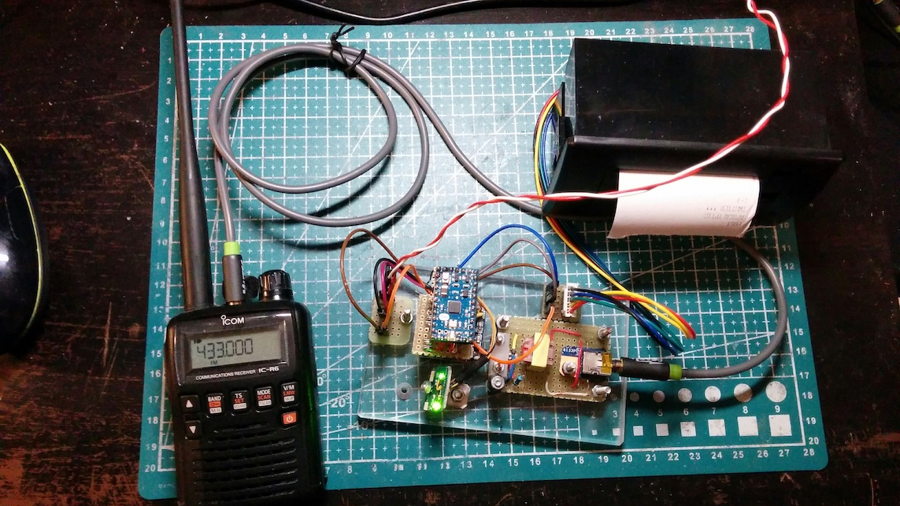
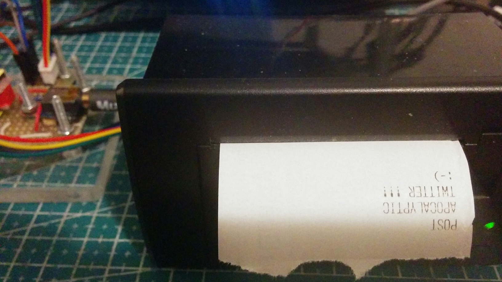
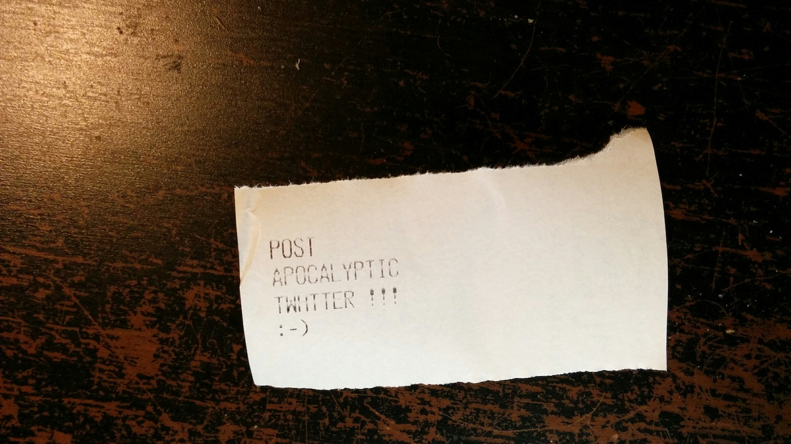
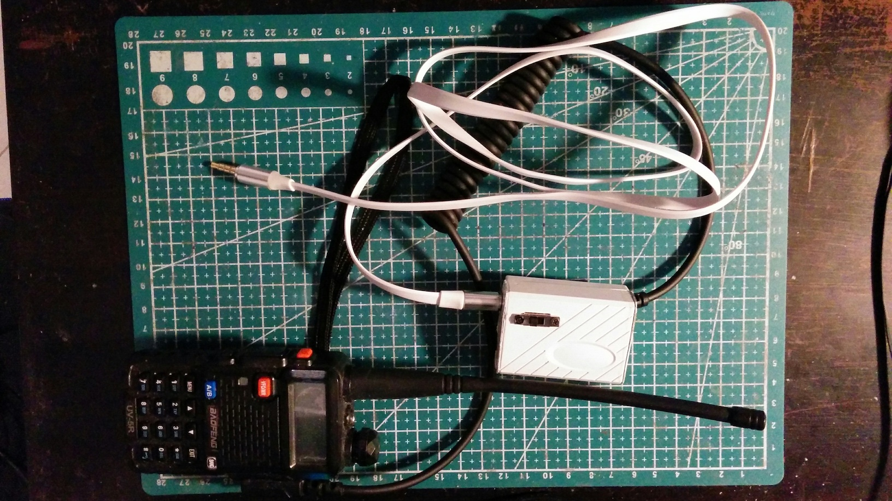
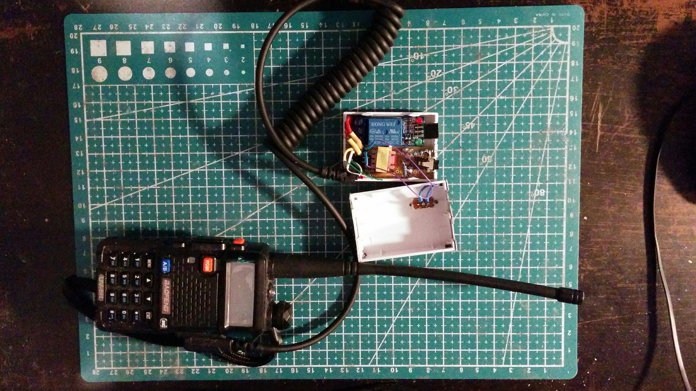
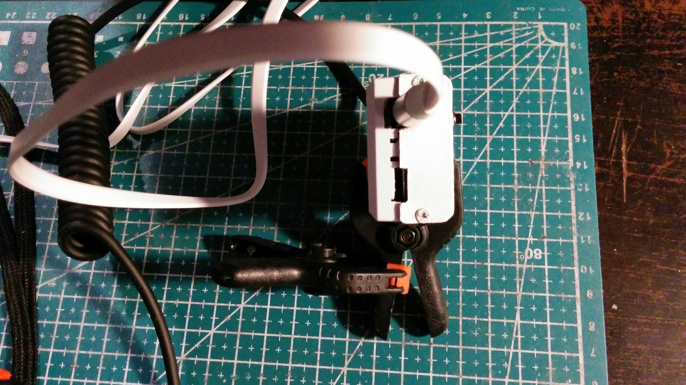
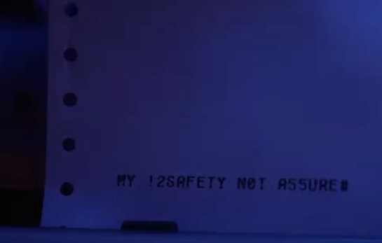
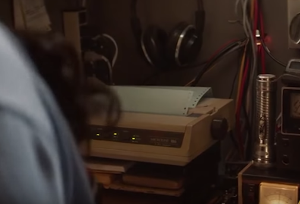

Description:
============

This is a POC of an improvised radio-teletype based on DTMF encoded messages. It receives radio broadcasted messages and prints them using a thermal printer. It was inspired by an apparatus fro the '80s seen in "The Walking Dead: World Beyond" series (See "Trivia" section below).

The system includes a receiver and a transmitter.

The receiver is a microcontroller based appliance:

The message are printed using a thermal printer:



The transmitter is based on a pc software part, my DTMF library and utilities ( https://github.com/gbonacini/dtmflib ) and an hardware part, the radio equipment, based on a walkie talkie and a custom cable:



the custom cable basically permits to emulate the continuous pressure of the PTT button (by switch or relais) and a signal decoupler:



here you can see the audio jack and the relais port for GPIO interfacing:




Prerequisites/Hardware:
=======================

I tested this software using an Arduino Mini based on ATMega328 microcontroller. The device also use an MT8870 as DTMF decoder,  microphone transformer as decoupler, walkie talkies as radio equipment and a cheap thermal printer.
I won't give a list with specific hardware because the program could be ported to any Arduino or microcontroller. Moreover I haven't a good user experience with that specific model of printer, so I won't recommend it:  you can use a TTL thermal printer of your choice.


Installation:
=============

Compile and install the program on the MC with the environment/IDE of your choice.
You also need the my DTMF tool available here: https://github.com/gbonacini/dtmflib

Documentation:
==============

After interfacing the walkie talkies with the radio teletype and setting the same frequency on both ends, you can encode a text message using the DTMF command ( see https://github.com/gbonacini/dtmflib ):
```
 dtmf -c mk.txt -o mk.txt.enc
```

where  mk.txt is the input file with the plain text and mk.txt.enc the encoded file.
Then you can send the message like this:
```
 cat mk.txt.enc | dtmf
```

the message will be printed on the receiving end using these conventions:

- ```<E>```  in case of parity error detected;
- ```<B>```  non-printable character received;
- ```Idx Err: -num-```  critical error.

* Important Note: A volume level too high in one or both the radios can create distortions interfering with the quality of the transmissions, set the audio level carefully starting by low levels and increasing using little steps, if required.


Trivia:
=======

Watching "The Walking Dead: World Beyond" series, you can see how they send short message in a post apocalyptic world where no cellphone network or Internet connectivity. They use some kind of ham radio based data transmission protocol. 

They use a very old apparatus, maybe something from the '80s/'90s,  with a dot matrix printer and something like a IBM PC desktop computer.
I find that configuration unrealistic, even in 2010 when the events of the series started. Good luck if you need replacement inked ribbon cartridge or continuous form paper. Moreover, in a world without electricity it's also unrealistic leaving on an apparatus absorbing hundreds of watts.




So I was thinking how a real life "post apocalyptic twitter" could look like: 
- low consumption devices;
- easy to move;
- easy-to-find printer connected;

So I build this one. It absorbs 8W (max) when the printer is working, could be built with whatever microcontroller you have available and it use a thermal printer, virtually available in every shop with its paper. I had some MT8870 available, this is IMHO the more difficult componente to find out but it could be replaced using a software routine , maybe using a different mc.
